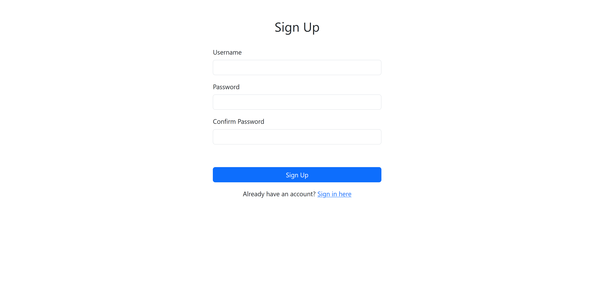
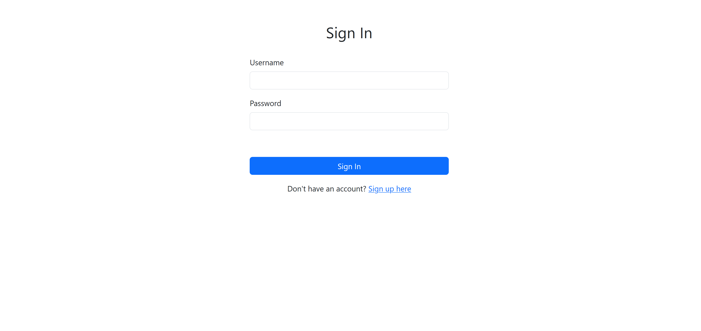
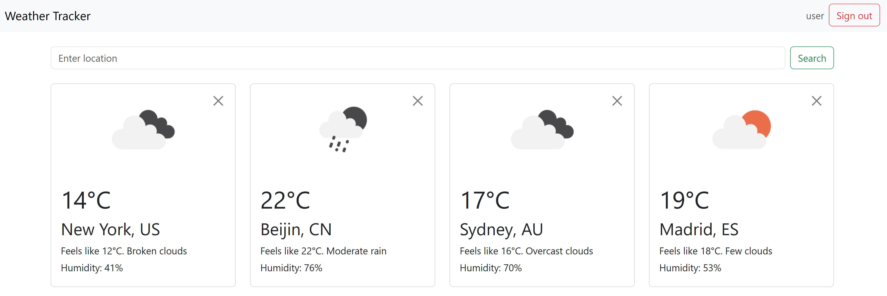
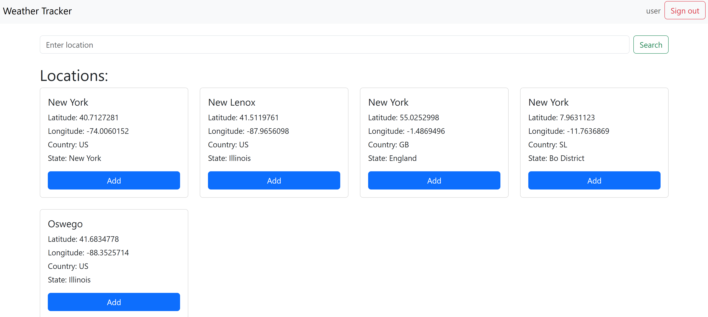
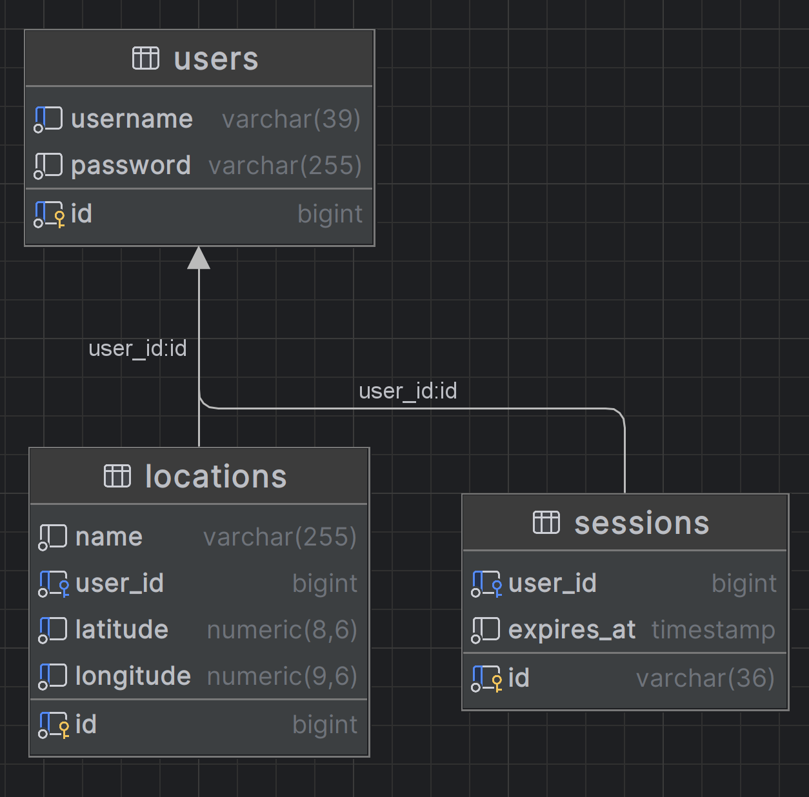

# Weather Tracker

## Overview

Weather Tracker is a web application that allows users to view the current weather for selected locations. 
Users can register, add various locations (cities, towns, etc.) to their collection, and monitor real-time weather information for each of these places.

## Technologies

- **Java 21**
- **Spring MVC**
- **Hibernate**
- **PostgreSQL**
- **Tomcat**
- **Docker / Docker Compose**
- **Gradle**
- **Thymeleaf**
- **Bootstrap**
- **Flyway**
- **Junit5**
- **Mockito**
- **Testcontainers**
- **Lombok**
- **MapStruct**
- **Passay**
- **HTML**
- **CSS**

## Interface






## Database Diagram



## Local project startup

To start the project locally, use the provided [docker-compose.yml](docker-compose.yml) file. This setup is intended for
development and testing purposes on a local machine.

**Key Points:** 
- **Open Weather API key:** You must set the system variable `OPEN_WEATHER_API_KEY` with your API key before starting application.
- **Docker Containers:** The local startup configuration includes Docker container with PostgreSQL.
- **Tomcat:** You will need to install and configure Tomcat manually or run it using IntelliJ IDEA.

**Steps to Run the project locally:**

1. Obtain free API key (60 requests per minute limit) and set it as the `OPEN_WEATHER_API_KEY` system variable.
2. Ensure you have Docker and Docker Compose installed.
3. Open your terminal in the project's root directory and run the following command to start the Docker containers in
   detached mode:
   ```bash
   docker-compose up -d
4. Run Tomcat using IntelliJ IDEA.

You can also use Docker Desktop for convenience.

## Deployment

**Key Points:**

- **Open Weather API key:** See instructions in the `Local Project Startup` section.
- **Docker Containers:** The server deployment configuration includes Docker containers for PostgreSQL and Tomcat.

For server deployment, use the [docker-compose-prod.yml](docker-compose-prod.yml) file.

**Steps to Deploy on a server:**

1. Create `.env.prod` based on [.env](.env) and add a new system variable `OPEN_WEATHER_API_KEY`
2. Ensure you have Docker and Docker Compose installed on your server.
3. Copy `docker-compose.prod.yml`, `.env.prod` to your server.
4. Navigate to the directory where the docker-compose-prod.yml file is located.
5. Run the following command to start the Docker containers in detached mode:

   ```bash
   docker-compose -f docker-compose-prod.yml up -d
   ```

## Contributing

Contributions are welcome! Please fork this repository and submit a pull request

## License

This project is licensed under the MIT License. See the [LICENSE](LICENSE) file for details.